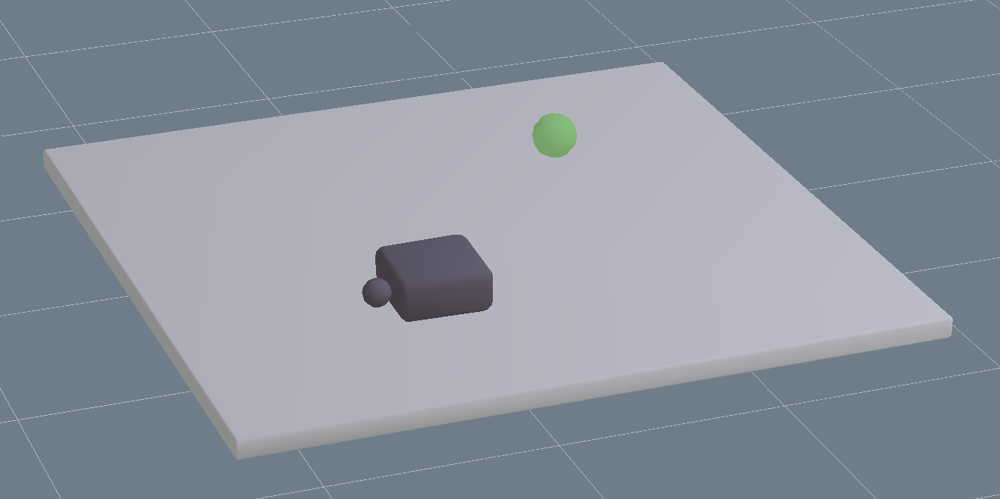

# OpenAI-Gym Robotics Manipulation Environment with KOMO Planning and Reward Shaping
[OpenAI-Gym](https://gym.openai.com/) environments for robotic manipulation tasks using the _open-source_ Nvidia PhysX simulator.

## Quick Start
Install using pip:
```shell
$ pip install .
```
And create environment object using gym registry:
```python
import gym
env = gym.make('gym_physx:physx-pushing-v0')
```
The environment exposes the standard OpenAI-Gym API:
```python
obs = env.reset()
while not done:
    action = my_policy(obs[‘observation’], obs[‘desired_goal’])
    obs, reward, done, info = env.step(action)
```
[`rai-python` at branch `plan_conditioned_rl`](https://github.com/ischubert/rai-python/tree/plan_conditioned_rl) is needed for the planning capabilities (see below). It is recommended to use the [`rai-python` Docker images](https://github.com/ischubert/rai-python/packages/). Alternatively, you can do the installation manually. Please see below for more details.

## Available Environments
- PhysxPushing: (See title image): The name of the game is to push the black box towards the green goal position. The black sphere ("finger") is can be moved into x-,y-, and z-direction.

## Integrated Planning Module
All environments contain planning modules that plan approximate manipulation sequences leading from the current state to a desired goal using k-order Markov optimization (KOMO), using Marc Toussaint's rai-python code https://github.com/ischubert/rai-python/tree/plan_conditioned_rl.

The approximate plan is updated each time `env.reset()` is called. It can also be updated manually using `env._get_approximate_plan()`.

## Plan-based Reward Shaping
The approximate plan can be used by the environment to provide a shaped reward signal either using potential-based reward shaping [(Ng et al. 1999)](http://luthuli.cs.uiuc.edu/~daf/courses/games/AIpapers/ml99-shaping.pdf) or final-volume-preserving reward shaping [(Schubert et al. 2021)](https://openreview.net/forum?id=w2Z2OwVNeK). In both cases, the shaped reward is returned by `env.step()` instead of the binary environment reward.

You can use reward shaping by specifying a shaper object:
```python
import gym
from gym_physx.envs.shaping import PlanBasedShaping

env = gym.make(
    'gym_physx:physx-pushing-v0',
    plan_based_shaping=PlanBasedShaping(shaping_mode='relaxed)
)
```

## `rai-python` setup

### Using the docker image (recommended)
Use the [`rai-python` Docker images](https://github.com/ischubert/rai-python/packages/) to get started right away:
```shell
$ docker pull docker.pkg.github.com/ischubert/rai-python/rai-python:plan_conditioned_rl
$ docker run -it docker.pkg.github.com/ischubert/rai-python/rai-python:plan_conditioned_rl
root@CONTAINER_ID:~/git$ git clone git@github.com:ischubert/gym-physx.git
root@CONTAINER_ID:~/git$ cd gym-physx
root@CONTAINER_ID:~/git/gym-physx$ pip install .
```
The `rai-python` Docker images are public, but github will ask you to log in before being able to pull the image from the registry.

### Manual Installation
Alternatively, install `rai-python` as detailed [here](https://github.com/ischubert/rai-python/tree/plan_conditioned_rl). Configure PhysX=1 in `config.mk` before running `make`.
